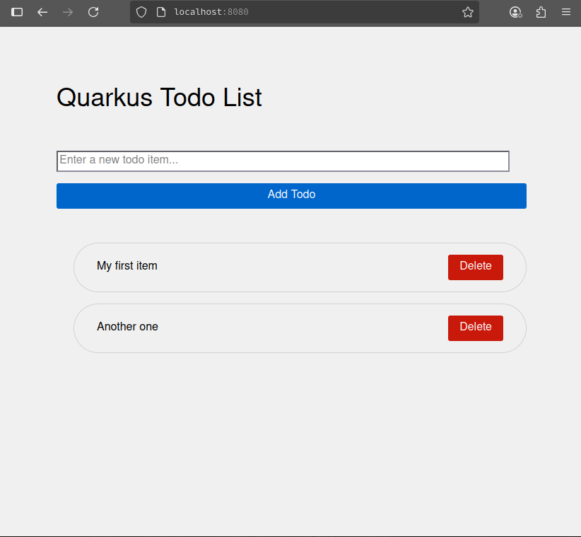

# Persistent Todo Application (qtodo)

This sample persistent todo application uses Quarkus.

If you want to learn more about Quarkus, please visit its website: <https://quarkus.io/>.


## Running the application in dev mode


### Prerequisites

* Java 17+

* Maven 3.8.x+

* Docker or Podman (for container build)

* A PostgreSQL database instance (ensure it's accessible and update application.properties with its connection details).

### Running postgres db locally in a container
> **_NOTE:_**  Application expects to have a postgres db running on localhost on port 5432 when running locally
This requires registering with registry.redhat.io to be able to pull the appropriate UBI backed container image

**Usage:**
```bash

# Run Red Hat UBI based container image with Postgres
podman run -d --name postgresql_database -e POSTGRESQL_USER=qtodo_user -e POSTGRESQL_PASSWORD=RedH@tPassw0rd -e POSTGRESQL_DATABASE=tasks -p 5432:5432 registry.redhat.io/rhel8/postgresql-16
```

You can then run your application in dev mode that enables live coding using:

```shell script
mvn quarkus:dev
```
### Accessing the web application:
Open your web browser and navigate to http://localhost:8080/.

Tasks will be persisted in the PostgreSQL database.


## Packaging and running the application

The application can be packaged using:

```shell script
mvn package
```

It produces the `quarkus-run.jar` file in the `target/quarkus-app/` directory.
Be aware that it’s not an _über-jar_ as the dependencies are copied into the `target/quarkus-app/lib/` directory.

The application is now runnable using `java -jar target/quarkus-app/quarkus-run.jar`.

If you want to build an _über-jar_, execute the following command:

```shell script
mvn package -Dquarkus.package.jar.type=uber-jar
```

The application, packaged as an _über-jar_, is now runnable using `java -jar target/*-runner.jar`.

## Creating a native executable

You can create a native executable using:

```shell script
mvn package -Dnative
```

Or, if you don't have GraalVM installed, you can run the native executable build in a container using:

```shell script
mvn package -Dnative -Dquarkus.native.container-build=true
```